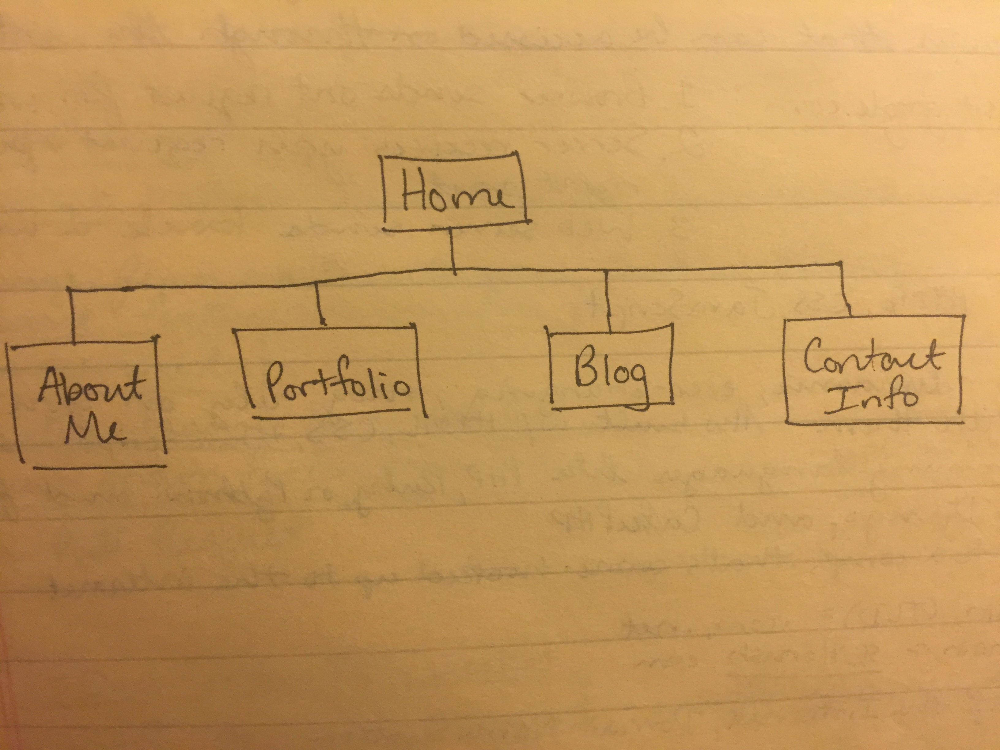

#2.3 Introduction to Design and Site Planning Reflection"

- **What are the 6 Phases of Web Design?**

**(1) Information Gathering**
Identify purpose, goals, target audience, and content of the website.

**(2) Planning**
Develop site map. A site map lists all of the main topic and subtopic areas of the site. While planning it's important to keep the customer/user in mind. Decide what technologies should be implemented.

**(3) Design**
Prototype the layout and visual aesthetics of the website. Wireframing and creating site mockups are helpful when prototyping ideas.

**(4) Development**
Create the site using HTML, CSS, Javascript (for websites).Begin by developing the home page, followed by a "shell" for the interior pages. The shell will serve as a template for the content pages of the site.

**(5) Testing and Delivery**
This is when the developer makes sure the site works properly and launches it on the web. Make sure your site meets current standards.

**(6) Maintenance**
Sites require up-keep. To attract more visitors or repeat visits it's helpful to update content. Other maintenance requirements may include site backups and additional plugin installations.

- **What is your site's primary goal or purpose? What kind of content will your site feature?**
My site will serve as a resume, showcasing who I am and what I have to offer as a developer. The site's content will include: About Me file - introducing the viewer to who I am; portfolio file - consisting of completed projects; link to blog; Contact Information.

- **What is your target audience's interests and how do you see your site addressing them?**
My target audiences are potential employers, and their interests lie in whether I'd be a skilled web developer and good fit for their company. My site will address this through the portfolio section, which will showcase my (eventual) knowledge of HTML, CSS, Ruby etc.

- **What is the primary "action" the user should take when coming to your site? Do you want them to search for information, contact you, or see your portfolio? It's ok to have several actions at once, or different actions for different kinds of visitors.**
I want potential employers to view my portfolio.

- **What are the main things someone should know about design and user experience?**
Design is all about problem solving. Performance + aesthetics = UX. User Experience (UX) is how a person feels when interfacing with a website, web application or desktop softare.

- **What is user experience design and why is it valuable?**
User-centered design means designing with the customer in mind, not the designer or client who has hired you. It aims at improving the user's accessibility, usability and pleasure. Websites have become very complex and feature-rich. In order to be effective, they must have thoughtful user experience designs. A good UX design can give a website an edge over its competitors by attracting more traffic/customers.

- **Which parts of the challenge did you find tedious?**
I spent a bit of time reorganizing my gitHub repositories and had a few moments where I thought I'd completly screwed up. I took a step back, had another sip of coffee, and activated the problem-solving areas of my brain.

