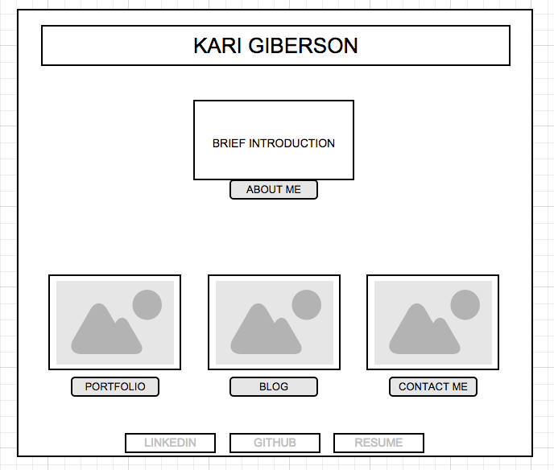
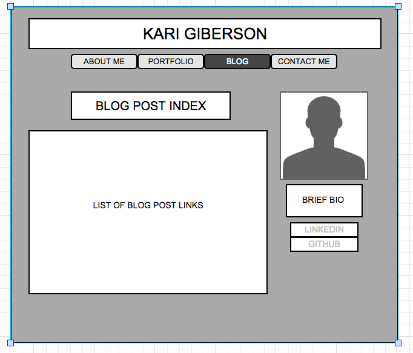

**What is a wireframe?**
A wireframe is a (usually) low-tech, visual skeletal framework of a website. Wireframing allows developers and designers to arrange elements and content to best accomplish the website's purpose. It connects the information architecture to the visual design of the website.

**What are the benefits of wireframing?**
Wireframing is an iterative process that allows developers to rapid prototype pages and explore multiple navigation systems and interface elements in order to decide on the best design before building out the website.

**Did you enjoy wireframing your site?**
I did, especially because moqups.com was so easy to use.

**Did you revise your wireframe or stick with your first idea?**
After visiting a few blogs that I follow and checking out a couple personal site, I decided to revise my original wireframe.

**What questions did you ask during this challenge? What resources did you find to help you answer them?**
What are examples of existing personal developer sites that have a flow/layout that I enjoy as a visitor to their site? I downloaded wirify and used it on a few blogs I follow that I feel utilize an enjoyable user flow.

**Which parts of the challenge did you enjoy and which parts did you find tedious?**
I loved the quick-and-dirty sketching portion and it's translation to a moqup wireframe. I tend to find the reflection portion of the challenges tedious - but I understand their importance, so I'm working on shifting my mindset to learn to the reflection section!
