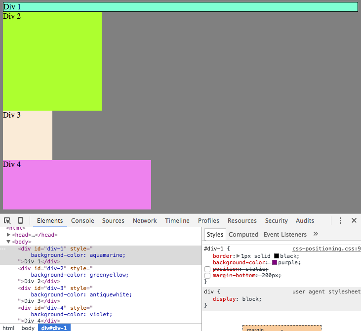
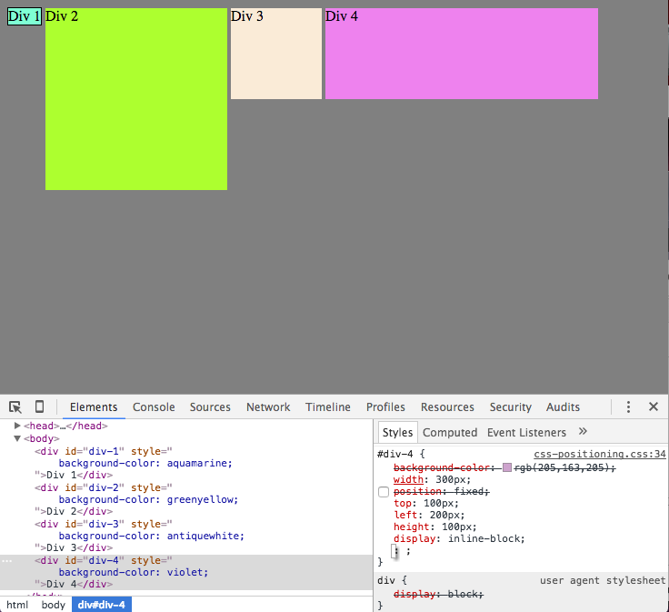

![Exercise_9](imgs/chrome_devtools-9.png

**How can you use Chrome's DevTools inspector to help you format or position elements?**
  Chrome's DevTools inspector displays teh DOM structure of the current web page and allows you to live-edit CSS to HTML elements. This is done from the elements and styles tabs. To format/position elements you can use adjust element's width, height, background-color, position, margin, padding, border etc.

**How can you resize elements on the DOM using CSS?**
  To resize elements on the DOM you can adjust their height & width property: value pairs.

**What are the differences between absolute, fixed, static, and relative positioning? Which did you find easiest to use? Which was most difficult?**
**Absolute** = Does not leave space for the element. Instead, it's positioned at a specified position relative to its closed positioned ancestor or to the containing block.
**Fixed** = Does not leave space for the element. Instead it's positioned at a specified position relative ot the screen's viewport. It doesn't move when scrolled. It will be printed at the fixed position of every page.
**Static** = the default position for all elements. It uses normal behavior, and will be laid out in its current position flow.
**Relative** = Lays out all elements as though the element were not positioned and then adjusts the elements position without changing the layout.

It took me a while to figure out how to make fixed work.

**What are the differences between margin, border, and padding?**

  Margin is the space between elements. Border is the element's defining line separating padding and margin. Padding is the space between the border and the content of the element.

**What was your impression of this challenge overall? (love, hate, and why?)**
  I enjoyed it, partially because my pair partner was highly enjoyable to work with. I felt we were able to work through each exercise slowly, making sure we understood what was happening as we changed the CSS properties.
